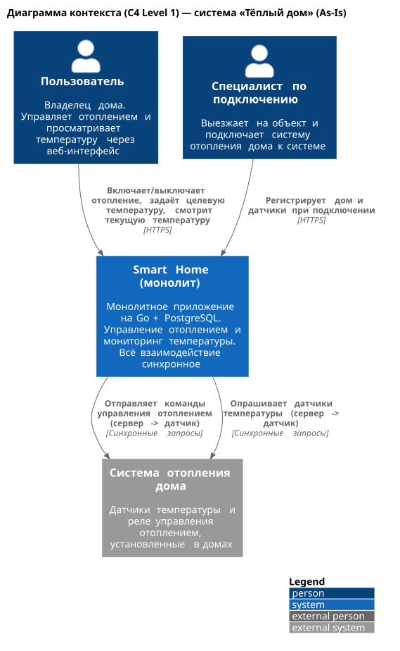
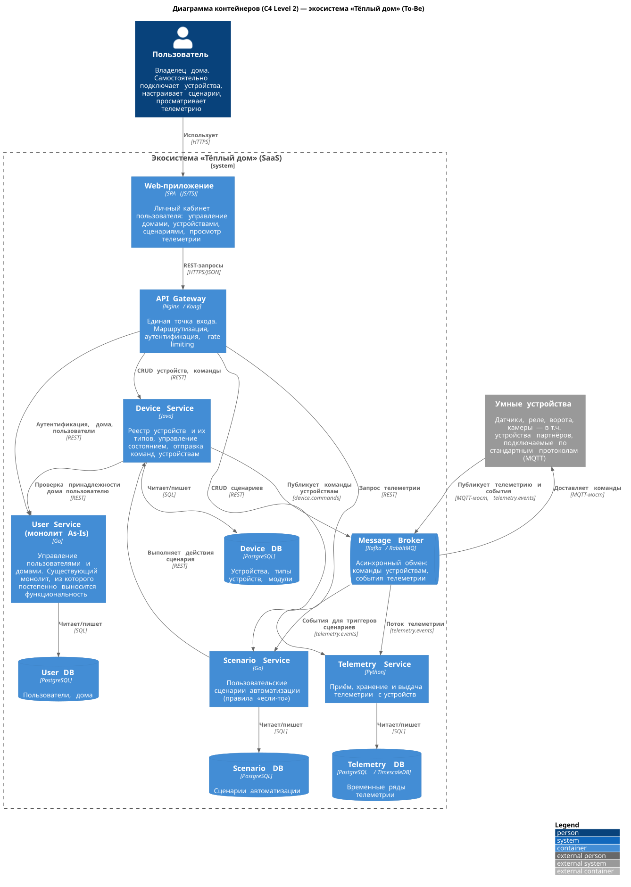
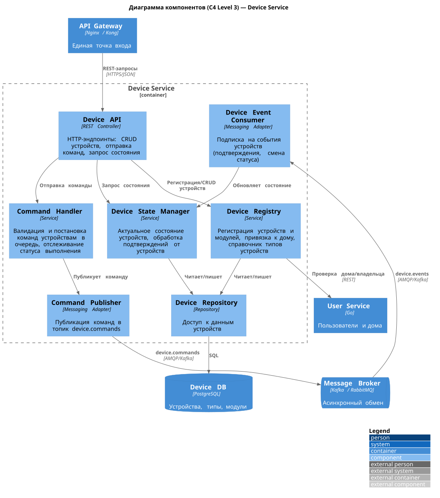
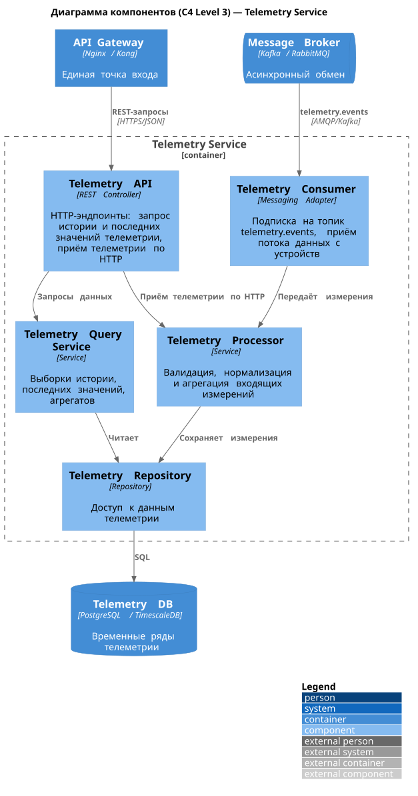
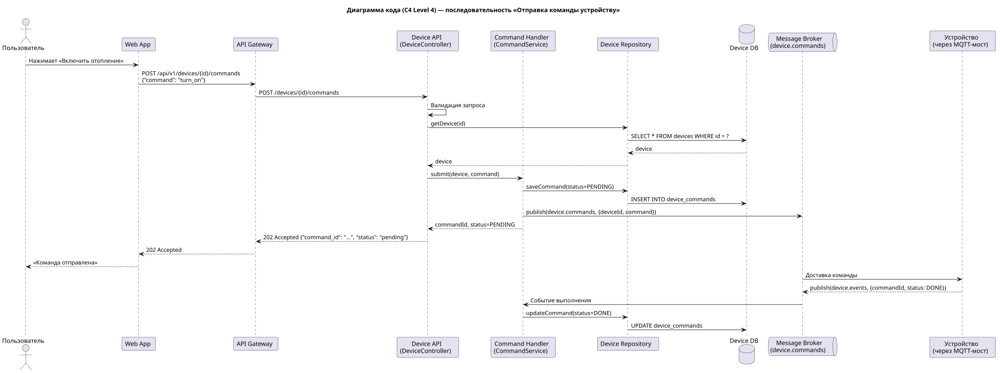
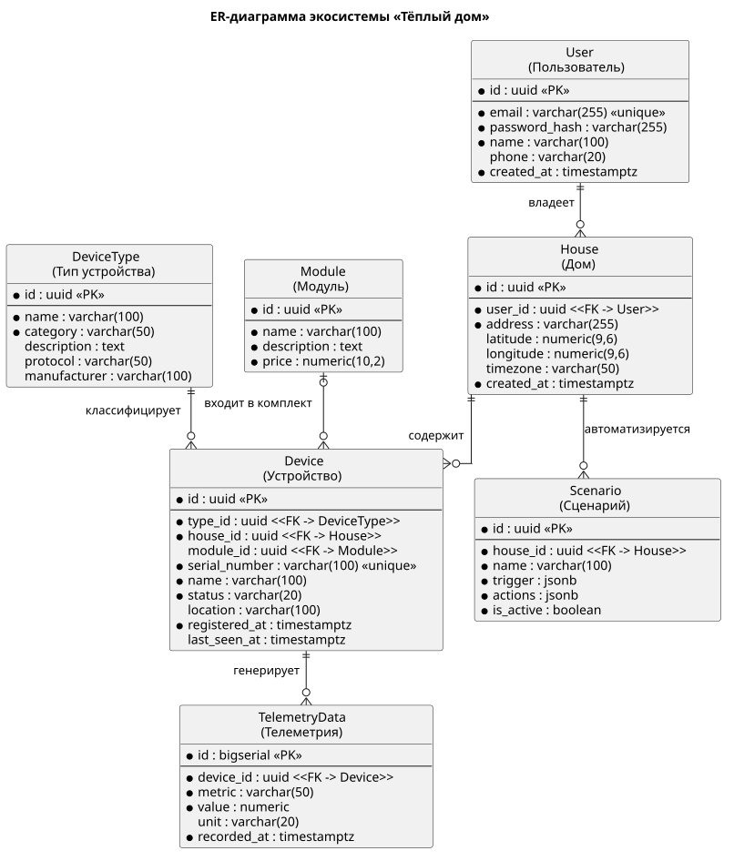

# Project_template

# Задание 1. Анализ и планирование

### 1. Описание функциональности монолитного приложения

**Управление отоплением:**

- Пользователи могут удалённо включать и выключать отопление в своих домах через веб-интерфейс
- Пользователи могут задавать целевую температуру
- Система управляет реле отопления: все команды идут от сервера к датчику синхронно.
- Каждое подключение дома к системе сопровождается выездом специалиста —
  самостоятельно подключить датчик пользователь не может.

**Мониторинг температуры:**

- Система получает данные о температуре с датчиков, установленных в домах,
  синхронным запросом от сервера к датчику
- Пользователи могут просматривать текущую температуру в своих домах через веб-интерфейс.
- Система поддерживает CRUD-операции над сенсорами
  (создание, просмотр, обновление, удаление)
  через REST API `/api/v1/sensors`

### 2. Анализ архитектуры монолитного приложения

- **Язык программирования:** Go
- **База данных:** PostgreSQL (таблица sensors)
- **Архитектура:** монолитная — обработка HTTP-запросов,
  бизнес-логика и работа с данными находятся в одном приложении
- **Взаимодействие:** синхронное; запросы обрабатываются последовательно,
  все вызовы блокирующие, асинхронных вызовов нет.
- **Масштабируемость:** ограничена — монолит нельзя масштабировать по частям, только целиком.
- **Развёртывание:** любое обновление требует остановки и перезапуска приложения.
- **Нагрузка сейчас:** 100 клиентов и 100 подключённых модулей отопления.

### 3. Определение доменов и границ контекстов

Выделенные домены и ограниченные контексты:

| Домен | Контекст | As-Is / To-Be |
|---|---|---|
| Управление пользователями и домами | учётные записи, дома, привязка устройств к домам | As-Is (внутри монолита) -> To-Be (User Service) |
| Управление устройствами | реестр устройств и их типов, состояние, команды устройствам | As-Is (частично: только отопление) -> To-Be (Device Service) |
| Телеметрия | приём, хранение и выдача измерений с датчиков | As-Is (частично: только температура) -> To-Be (Telemetry Service) |
| Сценарии автоматизации | пользовательские правила "если-то" | нет в As-Is -> To-Be (Scenario Service) |
| Подключение партнёрских устройств | интеграция по стандартным протоколам (MQTT) | нет в As-Is -> To-Be (MQTT-мост + брокер сообщений) |

### 4. Проблемы монолитного решения

- **Масштабирование:** нельзя масштабировать отдельно части, только всё приложение целиком
- **Развёртывание:** каждый релиз требует остановки всего приложения.
  Невозможно независимо выпускать функциональность разными командами
- **Синхронность:** опрос датчиков блокирует обработку.
  При росте системы время ответа деградирует,
  отказ датчика тормозит запросы
- **Расширяемость:** добавление новых типов устройств (свет, ворота, камеры)
  требует изменений по всему монолиту
- **Самообслуживание невозможно:** подключение нового дома требует выезда специалиста
- **Единая точка отказа:** падение одного компонента остановит всю систему

### 5. Визуализация контекста системы — диаграмма С4

Диаграмма контекста (C4 Level 1, As-Is): [schemas/context.svg](schemas/context.puml)



# Задание 2. Проектирование микросервисной архитектуры

Целевая архитектура построена по принципу Strangler Fig:
  монолит остаётся ядром управления пользователями и домами (User Service),
  а функциональность постепенно выносится в микросервисы.

Синхронное взаимодействие — REST через API Gateway,
  асинхронное — через брокер сообщений.
  У каждого сервиса своя база данных.

**Диаграмма контейнеров (Containers)**

[schemas/containers.puml](schemas/containers.puml)




**Диаграмма компонентов (Components)**

Device Service: [schemas/components-device-service.puml](schemas/components-device-service.puml)




Telemetry Service: [schemas/components-telemetry-service.puml](schemas/components-telemetry-service.puml)




**Диаграмма кода (Code)**

Последовательность "Отправка команды устройству":
  [schemas/code-send-command-sequence.puml](schemas/code-send-command-sequence.puml)



# Задание 3. Разработка ER-диаграммы

ER-диаграмма:
  [schemas/er-diagram.puml](schemas/er-diagram.puml)



ER - сущности и связи:

- **User — House:** один-ко-многим (пользователь владеет несколькими домами, дом принадлежит одному пользователю)
- **House — Device:** один-ко-многим (дом содержит несколько устройств, устройство принадлежит одному дому).
- **DeviceType — Device:** один-ко-многим (тип для многих устройств)
- **Module — Device:** один-ко-многим (модульный комплект включает несколько устройств;
  устройство может быть куплено вне комплекта, поэтому связь опциональная)
- **Device — TelemetryData:** один-ко-многим (устройство генерирует множество записей телеметрии)
- **House — Scenario:** один-ко-многим (для дома настраивается несколько сценариев автоматизации)

# Задание 4. Документирование API

### 1. Тип API

Используются оба типа взаимодействия:

- **REST API (OpenAPI 3.0)** — для синхронных запросов,
  когда клиенту нужен немедленный ответ: CRUD устройств, запрос состояния, выборка телеметрии.
- **AsyncAPI 3.0** — для асинхронного взаимодействия через брокер сообщений,
  когда ответ не нужен немедленно: поток измерений телеметрии от устройств - `telemetry.events`
  и доставка команд устройствам - `device.commands`.
  Это разгружает сервисы.

### 2. Документация API

- Device Service (REST, OpenAPI):
  [api-docs/device-service-openapi.yaml](api-docs/device-service-openapi.yaml) — регистрация
  устройства, получение информации, обновление состояния, отправка команды.
- Telemetry Service (REST, OpenAPI):
  [api-docs/telemetry-service-openapi.yaml](api-docs/telemetry-service-openapi.yaml) — приём измерения,
  последнее значение, история за период.
- События брокера (AsyncAPI): [api-docs/telemetry-asyncapi.yaml](api-docs/telemetry-asyncapi.yaml) — топики
 `telemetry.events` и `device.commands`.

Для каждого эндпоинта описаны формат запроса, формат ответа,
  коды ответов (200/201/202/400/404/409/500)

# Задание 5. Создание Dockerfile (docker и docker-compose)

Каталог - [apps](apps):

1. Приложение `temperature-api` ([apps/temperature-api](apps/temperature-api))
   при запросе `/temperature?location=` отдаёт случайное значение температуры
2. Приложение упаковано в Docker ([apps/temperature-api/Dockerfile](apps/temperature-api/Dockerfile))
   и добавлено в [apps/docker-compose.yml](apps/docker-compose.yml)
3. В docker-compose добавлен сервис `postgres` со скриптом `./smart_home/init.sql`

Проверка:
`docker-compose up -d --build`,
 затем в Postman-коллекции `smarthome-api.postman_collection.json`
 вызвать **Create Sensor** и **Get All Sensors**

При каждом вызове отображается новое значение температуры.

# Задание 6. Разработка MVP

Два новых микросервиса, интегрированных с монолитом по HTTP:

- **Device Service (Java 17)** — [apps/device-service](apps/device-service).
  Управление устройствами: `GET /api/v1/devices/{id}` (информация об устройстве через API монолита),
  `POST /api/v1/devices/{id}/commands` с телом `{"command": "turn_on" | "turn_off"}`
 (транслирует команду в вызов `PATCH /api/v1/sensors/{id}/value` монолита). Порт 8082.

- **Telemetry Service (Python 3.12, FastAPI)** — [apps/telemetry-service](apps/telemetry-service).
  Телеметрия: `POST /api/v1/telemetry` (приём измерения), `GET /api/v1/telemetry/{deviceId}/latest`,
  `GET /api/v1/telemetry/{deviceId}` (история). Каждые 10 секунд читает показания сенсоров
  из API монолита и сохраняет их как телеметрию и функциональность мониторинга постепенно переезжает из монолита.

Для обоих сервисов созданы Dockerfile, оба в [apps/docker-compose.yml](apps/docker-compose.yml)

Запускаются вместе с монолитом командой `docker-compose up -d --build`

Проверка MVP:

```
# состояние устройства через Device Service
curl http://localhost:8082/api/v1/devices/1
```

```
# команда устройству через Device Service
curl -X POST http://localhost:8082/api/v1/devices/1/commands \
  -H "Content-Type: application/json" -d '{"command": "turn_on"}'
```

```
# телеметрия, собранная с монолита
curl http://localhost:8083/api/v1/telemetry/1/latest
curl http://localhost:8083/api/v1/telemetry/1
```
